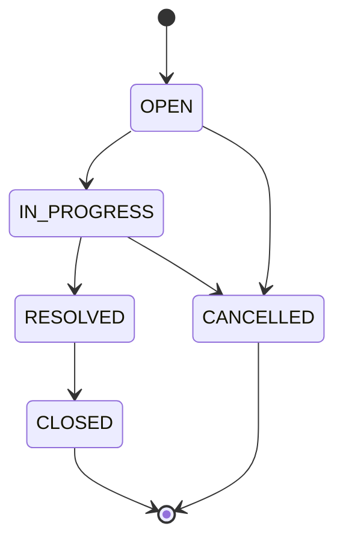
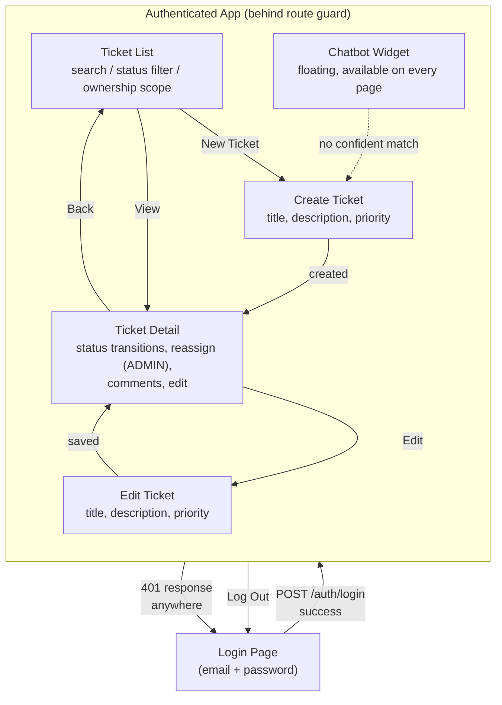

# Ticketing System UI

A React + TypeScript single-page application for creating, tracking, and resolving support tickets, with role-based access control and an authenticated RAG (Retrieval-Augmented Generation) resolution chatbot that helps users find answers from previously resolved tickets before raising a new one.

This repository contains the **frontend only**. It consumes a separate backend service (see [Prerequisites](#prerequisites)) that owns persistence, authentication, and business-rule enforcement.

## Table of Contents

- [Prominent Features](#prominent-features)
- [Prerequisites](#prerequisites)
- [Deployment](#deployment)
- [Ticket Management Rules](#ticket-management-rules)
- [Ticket State Diagram](#ticket-state-diagram)
- [UI Flow Diagram](#ui-flow-diagram)

## Prominent Features

- **Authenticated access with role-based UI** — email/password login against the backend; three roles (`SUPPORT`, `GENERAL`, `ADMIN`) drive what each user can see and do.
- **Ticket lifecycle management** — create, view, edit, and transition tickets through a backend-enforced status state machine, with the UI offering only valid next transitions.
- **Auto-assignment & admin reassignment** — new tickets are automatically assigned to the least-loaded support agent; only `ADMIN` users can manually reassign a ticket.
- **Ownership-scoped ticket list** — filter tickets by "Created by me," "Assigned to me" (hidden for `GENERAL` users), or "All," with search and status filtering.
- **Creator/assignee-scoped commenting** — only a ticket's creator or its currently assigned support agent can add comments; comments show author name and are never edited or deleted.
- **Persistent RAG resolution chatbot** — a floating chat widget, available on every authenticated page, that answers free-text questions grounded in resolved tickets (with citations) or tells the user to raise a new ticket if no confident match exists. Conversations persist across navigation and expire after 30 minutes of inactivity.
- **Session-expiry handling** — a `401` response from the backend at any point cleanly signs the user out and redirects to login, rather than surfacing a raw error.

## Prerequisites

- **Node.js 20 LTS** and npm
- A running instance of the companion **ticketing system backend** (implements the `005-auth-rag-chatbot` API contract; see `backend-api-doc.json` in this repo for the OpenAPI spec), reachable over HTTP, seeded with:
  - at least one `SUPPORT`, one `GENERAL`, and one `ADMIN` user
  - at least one resolved ticket (so the chatbot has something to ground answers in)
- One environment variable, set at **build time** (Vite inlines env vars during build, they are not runtime-configurable):
  ```
  VITE_API_BASE_URL=http://localhost:8080
  ```
  Copy `.env.example` to `.env.local` and set this to your backend's base URL. The app fails fast at startup if it is unset.

> The automated test suite (`npm test`) does **not** require a live backend — it runs against Mock Service Worker (MSW) handlers under `tests/msw/`.

## Deployment

Install dependencies and build a static production bundle:

```bash
npm install
npm run build     # runs `tsc --noEmit` then `vite build`
```

The build output is a static bundle in `dist/`. Serve it from any static host, CDN, or reverse proxy, pointed at a backend reachable at the `VITE_API_BASE_URL` baked in at build time.

To preview a production build locally:

```bash
npm run preview
```

For local development against a running backend:

```bash
npm run dev
```

Other useful scripts:

```bash
npm run typecheck   # tsc --noEmit only
npm run lint        # eslint .
npm test            # vitest run (uses MSW mocks, no backend needed)
npm run test:watch  # vitest in watch mode
```

**Note:** this repository does not currently include a Dockerfile or CI/CD pipeline. Containerizing the static build and wiring up a pipeline is left as future work — treat the steps above as the manual deployment path today.

## Ticket Management Rules

- **Status transitions are enforced exclusively by the backend.** The UI only ever *suggests* valid next transitions for usability; every transition request round-trips through the backend, and a rejected transition (HTTP `409`) leaves the displayed status unchanged.
- **Assignment on creation is automatic.** A new ticket cannot be created with a manually chosen assignee — the backend assigns it to the least-loaded `SUPPORT` user.
- **Reassignment is admin-only.** Only an `ADMIN` user can move a ticket to a different `SUPPORT` user after creation.
- **Commenting is restricted.** Only a ticket's creator or its currently assigned `SUPPORT` user may add a comment. Comments are immutable once posted and always attributed to their author.
- **Viewing a single ticket is restricted.** Only the ticket's creator, its assignee, or any `SUPPORT`/`ADMIN` user may view its detail page; anyone else is shown a permission-denied message.
- **List visibility is ownership-scoped.** Users can filter the ticket list to tickets they created, tickets assigned to them (not available to `GENERAL` users, who are never assignees), or all tickets.
- **Required fields on creation.** A ticket requires a `title` (max 200 characters) and a non-empty `description`; `priority` is one of `LOW`, `MEDIUM`, `HIGH`, `CRITICAL`.

## Ticket State Diagram



Terminal states are `CLOSED` and `CANCELLED` — no transitions are permitted out of either (for example, `CLOSED → OPEN`, `RESOLVED → OPEN`, and `CANCELLED → OPEN` are all rejected by the backend).

## UI Flow Diagram



The chatbot widget floats above every authenticated page and is not tied to a route — a conversation started on one page continues if the user navigates elsewhere, until 30 minutes of inactivity or an explicit "End chat."
